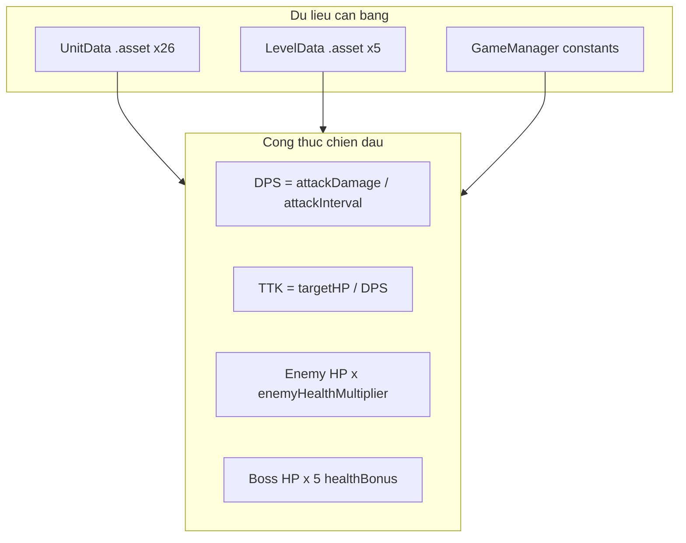
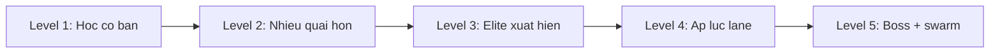
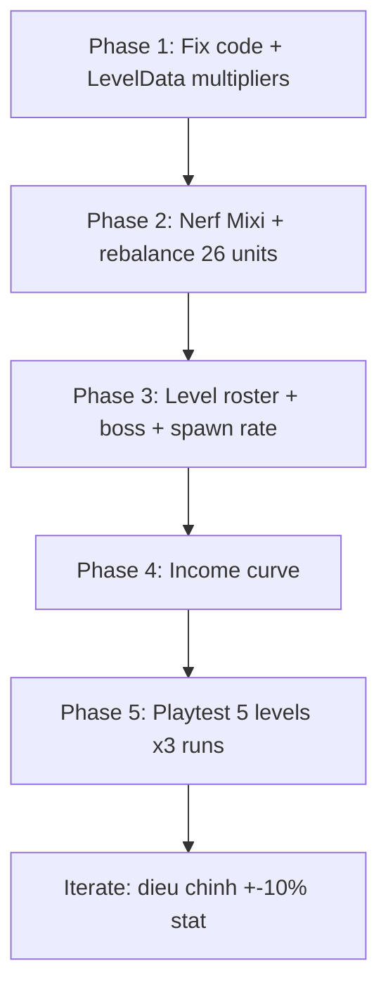

# Kế hoạch cân bằng Battle Meme (PvE)

## Bối cảnh hiện tại

Game là **lane auto-battler kiểu Battle Cats**: unit tiến/lui, dừng đánh mục tiêu đầu tiên trong tầm, thắng khi phá base địch. Combat dùng **sát thương phẳng** (không giáp), không có công thức phức tạp.



**Vấn đề lớn nhất cần xử lý trước:**

| Vấn đề | Tác động |
|--------|----------|
| [DoMixi Meme.asset](Assets/_ScriptableObjects/player%20units/DoMixi%20Meme.asset): 500 DMG, 200 DPS tại cost 50 | Starter phá vỡ mọi unit khác |
| `baseHealthMultiplier` trong [LevelData.cs](Assets/_Scripts/LevelData.cs) **không được code đọc** | Level 2–5 không khó hơn về máu base dù đã ghi 2–5 |
| `enemyHealthMultiplier` = 1 trên **tất cả 5 level** | Quái/boss không scale HP theo màn |
| Cost không gắn với power; cooldown ẩn (0s–100s) | Unit đắt/yếu hoặc rẻ/mạnh bất hợp lý |
| Player speed ~0.6–0.9 vs enemy ~1.5–3.0 | Địch áp sát base nhanh, gây áp lực lane không cân |
| Level-up income: `mul += 2*mul` trong [GameManger.cs](Assets/_Scripts/GameManger.cs) | Upgrade thu nhập tăng giá quá nhanh |

---

## Nguyên tắc cân bằng (Battle Cats PvE)

### 1. Định nghĩa chỉ số ảo (dùng để so sánh, không cần code mới)

```
EffectiveDPS = attackDamage / attackInterval
Survivability = health / (enemyAvgDPS × timeInCombat)
LanePressure = moveSpeed × (health / cost)   // khả năng giữ lane
PowerScore = EffectiveDPS × sqrt(health) / cost × cooldownFactor
cooldownFactor = min(1, 30 / max(spawnCooldown, 1))   // penalize CD > 30s
```

### 2. Phân vai trò 5 archetype (mỗi unit thuộc 1–2 vai trò)

| Archetype | Mục tiêu | Ví dụ hiện tại | Target cost |
|-----------|----------|----------------|-------------|
| **Swarm** | Spam, chặn địch, DPS thấp | pepe, trollface3, shiba2 | 30–45$ |
| **Tank** | Giữ lane, HP cao | saltedegg, sigmaman, coffindance | 50–100$ |
| **DPS** | Sát thương ổn | therock, pandameme, pewpew | 45–80$ |
| **Sniper** | Tầm xa, burst | simson, pooh, ishowspeed | 80–120$ |
| **Special** | Trade-off rõ (glass cannon / slow heavy) | shrek, cappypara, mu | 70–175$ |

**Mục tiêu PvE:** Không có unit "best in slot" — mỗi màn thưởng team đa dạng (tank chặn + DPS sau + sniper xử lý boss).

### 3. Target power theo cost tier

| Cost ($) | Target DPS | Target HP | Cooldown hợp lý |
|----------|-----------|-----------|-----------------|
| 30–40 | 8–15 | 350–500 | 3–5s |
| 45–60 | 20–35 | 250–600 | 5–15s |
| 65–90 | 40–70 | 300–500 | 10–25s |
| 100–130 | 60–90 | 400–1000 | 15–30s |
| 140–175 | 70–100 | 600–1500 | 25–40s (không 100s) |

---

## Phase 1 — Sửa hệ thống bị hỏng (code, ưu tiên cao)

### 1.1 Kích hoạt `baseHealthMultiplier`

Trong [BaseHealth.cs](Assets/_Scripts/BaseHealth.cs), áp dụng cho **cả player base và enemy base** (hoặc chỉ enemy base nếu muốn player base cố định):

```csharp
// Enemy base
maxHealth *= currentLevel.baseHealthMultiplier;
// Player base: giữ 1000 hoặc scale nhẹ (x1.0–x1.2) để tránh quá khó sớm
```

Level hiện tại đã có giá trị sẵn trong [Level_1.asset](Assets/_ScriptableObjects/lever%20castle/Level_1.asset) đến [Level_5.asset](Assets/_ScriptableObjects/lever%20castle/Level_5.asset) (1, 2, 3, 4, 5) — chỉ cần wire vào code.

### 1.2 Bật `enemyHealthMultiplier` theo màn

Cập nhật 5 file `Level_*.asset`:

| Level | enemyHP× | baseHP× | Gợi ý |
|-------|----------|---------|-------|
| 1 | 1.0 | 1.0 | Tutorial, quái yếu |
| 2 | 1.2 | 1.5 | Thêm 1 enemy type |
| 3 | 1.4 | 2.0 | |
| 4 | 1.6 | 3.0 | |
| 5 | 1.8 | 4.0 | 6 enemy types, boss khó |

*(Giảm từ giá trị 5 trong asset xuống 4.0 cho Level 5 nếu boss fight quá dài sau khi test.)*

### 1.3 Sửa công thức Level-up income

Trong [GameManger.cs](Assets/_Scripts/GameManger.cs), thay `mul += 2*mul` (tăng exponential quá nhanh) bằng curve ổn định hơn:

```
cost(level) = 10 × level²          // thay vì mul × level với mul bùng nổ
incomeBonus = 3 + level            // +4, +5, +6... mỗi lần upgrade
```

Giữ cap tiền `level × 300` hoặc tăng lên `level × 400` để unit 150–175$ vẫn summon được ở late game.

### 1.4 Dọn dữ liệu (không ảnh hưởng combat nhưng tránh bug roster)

- Chuẩn hóa ID: `bitchplese` ↔ `bitchplease`, `ricadomilos` ↔ `ricardomilos`, `saltedeggs` ↔ `saltedegg`
- Loại `DoMixi SUPE` (cost 0) khỏi `allHeroesDatabase` hoặc gán cost/cooldown bình thường
- Sửa `unitName` copy-paste "Pepe" trên các asset

---

## Phase 2 — Nerf vừa Độ Mixi + rebalance 26 unit

### 2.1 Độ Mixi (starter flagship, không broken)

**Hiện tại:** HP 500, DMG 500, interval 2.5, range 0.7, cost 50 → 200 DPS

**Target sau nerf vừa** (vẫn SR-tier, mạnh hơn therock nhưng không one-shot):

| Stat | Cũ | Mới (đề xuất) |
|------|-----|---------------|
| attackDamage | 500 | **80–100** |
| attackInterval | 2.5 | **2.0** |
| health | 500 | **450** |
| attackRange | 0.7 | **0.45** |
| spawnCooldown | 5 | **8** |
| cost | 50 | **55** |

→ DPS ~40–50, vẫn top tier ở cost 55 nhưng không xóa mọi enemy/boss trong 1–2 hit.

### 2.2 Unit cần buff (underpowered so với cost)

| Unit | Vấn đề | Hướng chỉnh |
|------|--------|-------------|
| shiba2 (60$, 5 DPS) | Quá yếu | DMG 5→12 hoặc cost 60→40 |
| saltedegg (40$, 4.7 DPS) | Tank nhưng DPS quá thấp | DMG 7→12, giữ HP 500 |
| ishowspeed (45$, 200 HP) | Glass quá mong manh | HP 200→280 |
| bitchplease (80$, 46 DPS) | Không xứng cost | DMG 23→35 hoặc interval 0.5→0.4 |
| yunoman (50$, CD 50s) | CD quá dài | CD 50→20 |

### 2.3 Unit cần nerf (overpowered / spam)

| Unit | Vấn đề | Hướng chỉnh |
|------|--------|-------------|
| trollface3 (40$, CD 0) | Spam vô hạn | CD 0→4s hoặc cost 40→55 |
| shrek (70$, CD 0, 100 DMG) | Glass cannon spam | CD 0→6s, HP 150→200 |
| penguin (70$, 133 DPS) | DPS quá cao cho cost | DMG 100→65 hoặc interval 0.75→1.0 |
| mu (175$, 150 DPS) | DPS/$ quá tốt | DMG 50→40 hoặc cost 175→200 |
| slenderman (90$, 60 DPS) | Hiếm nhưng quá mạnh | DMG 15→12, interval 0.25→0.35 |

### 2.4 Unit giữ nguyên / chỉnh nhẹ (đã gần đúng vai trò)

- **pepe** — starter swarm baseline (giữ làm chuẩn 30$)
- **sigmaman, coffindance** — tank archetype
- **cappypara** — super tank: giữ HP cao, **giảm CD 100→45s** (vẫn đặc biệt nhưng playable)
- **simson, ricardomilos** — sniper/DPS tầm xa

### 2.5 Cách thực hiện

Chỉnh trực tiếp 26 file trong [Assets/_ScriptableObjects/player units/](Assets/_ScriptableObjects/player%20units/) — **không cần đổi code** nếu giữ schema [UnitData.cs](Assets/_Scripts/UnitData.cs).

---

## Phase 3 — Cân bằng PvE 5 màn

### 3.1 Đường cong độ khó



**Tham số mỗi level** ([LevelData](Assets/_Scripts/LevelData.cs)):

| Level | enemiesToKillForBoss | spawnInterval | Enemy roster focus |
|-------|---------------------|---------------|-------------------|
| 1 | 5 | 2.5s | 5 quái yếu (60–100 HP) |
| 2 | 8 | 2.2s | + trollface, pewpew |
| 3 | 12 | 2.0s | + steave, yunoman |
| 4 | 18 | 1.8s | + penguin, coffindance enemy |
| 5 | 22 | 1.6s | Full roster 6 types |

Điều chỉnh trong [EnemyAI.cs](Assets/_Scripts/EnemyAI.cs) / scene: `spawnInterval` hiện hardcode 2s trong SampleScene — nên đưa vào `LevelData` để mỗi màn khác nhau.

### 3.2 Boss tuning

Boss HP hiện = `baseHP × 5 (healthBonus)` → effective 9k–25k. Với player DPS trung bình ~30–50 sau rebalance:

| Boss | Base HP | Đề xuất base HP | Lý do |
|------|---------|-----------------|-------|
| Bot_pepe (L1) | 5000 | **3500** | Trận đầu ~2–3 phút |
| Bot_Domixi (L2) | 1800 | **2500** | |
| Bot_coffindance (L3) | 3500 | **3200** | |
| Bot_shiba (L4) | 2600 | **3000** | |
| Bot_Cappybara (L5) | 4200 | **4000** | Final boss ~4–6 phút |

Có thể giảm `healthBonus` từ 5→**3.5** trong `SpawnBoss()` nếu fight vẫn quá dài.

### 3.3 Enemy speed vs player

Giảm `moveSpeed` enemy elite từ 3.0 xuống **2.0–2.2** trên các asset [ennemy units/](Assets/_ScriptableObjects/ennemy%20units/) — giữ áp lực nhưng cho tank kịp intercept.

---

## Phase 4 — Kinh tế trong trận (hỗ trợ PvE)

Không ưu tiên gacha (theo lựa chọn của bạn), chỉ tune đủ để PvE playable:

| Tham số | Hiện tại | Đề xuất |
|---------|----------|---------|
| `moneyPerSecond` | 7 | **8** (level 1), scale +1 mỗi 2 level upgrade |
| Money cap | level × 300 | **level × 400** |
| Starting money | 0 | **0** (giữ — buộc học quản lý tiền) |
| First summon timing | ~4s (pepe) | OK sau rebalance cost |

**Mục tiêu:** Level 1 clear được với team starter (pepe + domixi đã nerf + shiba + sigmaman + bitchplease) trong **3–5 phút** mà không cần unit SSR.

---

## Phase 5 — Kiểm thử và vòng lặp

### Checklist playtest mỗi level

1. Chơi full run với **team starter** (5 hero mặc định) — win rate target: L1 90%, L2 70%, L3 50%, L4 35%, L5 20%
2. Chơi với **team toàn Common** vs **team mixed roles** — mixed phải dễ hơn rõ rệt
3. Đo **thời gian trận**: L1 3–4 min, L5 6–8 min
4. Kiểm tra **không unit nào** chiếm >40% total damage trong 1 trận
5. Boss không chết trước khi minion wave clear (boss spawn đúng timing)

### Công cụ hỗ trợ (tùy chọn, phase sau)

- Thêm `Debug.Log` tổng damage per unit type trong `Unit.Die()` (dev only)
- Spreadsheet export từ UnitData assets để so sánh PowerScore

---

## Thứ tự triển khai đề xuất



**Ước lượng effort:** ~2–3 giờ chỉnh asset + 1 giờ code fix + 2 giờ playtest/iterate.

## Phạm vi KHÔNG làm trong đợt này

- Gacha drop rate / rarity sync (bạn chọn PvE, không gacha-fair)
- Thay đổi combat formula (thêm giáp, crit, v.v.)
- Chỉnh sprite Prices (git diff hiện tại là visual, không ảnh hưởng balance)

## File chính sẽ chạm

**Code:** [BaseHealth.cs](Assets/_Scripts/BaseHealth.cs), [GameManger.cs](Assets/_Scripts/GameManger.cs), có thể [LevelData.cs](Assets/_Scripts/LevelData.cs) + [EnemyAI.cs](Assets/_Scripts/EnemyAI.cs) nếu thêm `spawnInterval` per level

**Data:** 26 file [player units/](Assets/_ScriptableObjects/player%20units/), 5 [lever castle/](Assets/_ScriptableObjects/lever%20castle/), 5 [Boss/](Assets/_ScriptableObjects/Boss/), ~10–15 [ennemy units/](Assets/_ScriptableObjects/ennemy%20units/) (speed/HP)
